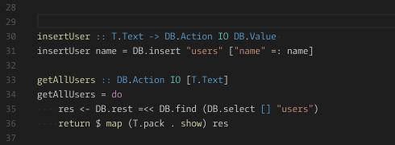
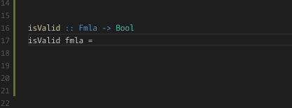

# Haskelly

[Release notes](https://github.com/haskelly-dev/Haskelly/releases)  | [Roadmap](https://trello.com/b/vsMlLU4h/haskelly-features) | [Demo Video](https://www.youtube.com/watch?v=r3x64iz5xDk)

`Haskelly` is a [Visual Studio Code](https://code.visualstudio.com/) extension that supports Haskell development.

## Features

* __Code highlight__
  - Haskell (`.hs` and `.lhs`) and Cabal via automatic devendency on [Haskell Syntax Highlighting](https://marketplace.visualstudio.com/items?itemName=justusadam.language-haskell).

* __Code snippets__
  - Structures : `data`, `newtype`, etc.
  - Ppopular functions : `map`, `fold`, etc.


* __Type hovers__
    - 


* __Jump to definition__
  - Jump to symbol definitions/declarations


* __Find references__
  - Find references within a module or depending modules. See limitations on [#62](https://github.com/haskelly-dev/Haskelly/issues/62)


* __Code completion__ :
    - Local functions and constants
    - Standard library
    - Imported modules

    


* __Integrated REPL, Build, Test and Run commands__
  - repl with `GHCi`
  - build with `stack`
  - run with `runHaskell`
  - test current file `prop_*` properties with `QuickCheck`
  - run full test suite with `Stack test`

## Installation

  * Install the [Haskelly](https://marketplace.visualstudio.com/items?itemName=UCL.haskelly) VS Code extension.

  * Install [Stack](https://www.haskellstack.org) and add it to your PATH.

    ```shell
    curl -sSL https://get.haskellstack.org/ | sh
    ```

  * Install [Intero](https://github.com/commercialhaskell/intero) (code completion and type information), [QuickCheck](https://hackage.haskell.org/package/QuickCheck) (test suite) and [stack-run](https://hackage.haskell.org/package/stack-run):

    ```shell
    stack install intero QuickCheck stack-run  # for a global installation
    stack build intero QuickCheck stack-run # for a local installation
    ```

## Configuration

Haskelly is customizable
(see `Code` > `Preferences` > `Workspace Settings`).

|param                          | description              |
|----------------------------   |--------------------------|
| `haskelly.codeCompletion`     | Set to `false` to disable code completion|
| `haskelly.buttons.ghci`       | Set to `false` to hide the `GHCi` button in the bottom bar|
| `haskelly.buttons.runfile`    | Set to `false` to hide the `Run file` button in the bottom bar|
| `haskelly.buttons.quickcheck` | Set to `false` to hide the `QuickCheck` button in the bottom bar|
| `haskelly.buttons.stackRun`   | Set to `false` to hide the `Stack run` button in the bottom bar|
| `haskelly.buttons.stackTest`  | Set to `false` to hide the `Stack test` button in the bottom bar|
| `haskelly.snippets.important` | Set to `true` to hide code completion for which there's already a snippet|
| `haskelly.snippets.custom`    | Add your custom snippets following the structure of this [file](https://github.com/haskelly-dev/Haskelly/tree/master/languages/snippets/haskell.json)|


## Contributing

If you'd like to contribute to Haskelly, this is what you can do:

* __Bugs__: This extension is in alpha, so some bugs might be present. We would really appreciate if you
could post any issue on the Github repository [issues section](https://github.com/haskelly-dev/Haskelly/issues) or contact us at: [zcabmse@ucl.ac.uk](mailto:zcabmse@ucl.ac.uk?Subject=Haskelly%20feedback).
* __Ideas and feature requests__: We want to get everyone's opinion on what we're building so feel free to use the two mentioned channels for any comment or suggestion.
* __Documentation__: Found a typo or strangely worded sentences? Submit a PR!
* __Code__: Contribute bug fixes, features or design changes.


## License: [GNU 3](https://github.com/haskelly-dev/Haskelly/blob/master/License.txt)
